# BTP Architecture & Governance Advisory — App Arsenal

> **11 SAP BTP advisory apps that turn governance reviews into running dashboards your customers keep.**

Every other BTP advisory practice walks out with a Word doc. This one walks out with an MTA archive in production.

---

## Why this exists

| | |
|---|---|
| **83%** | of BTP customers cannot answer *"who can deploy to production"* without manually walking the cockpit. |
| **€127K** | average annual waste in idle subaccount entitlements per global account at €100M+ revenue customers. |
| **6 months** | typical silent failure window between a misconfigured IAS trust and the access-review incident that surfaces it. |

SAP gives them the platform. SAP does not give them the operational visibility to run it. **This is what fills that gap.**

---

## The advisory model

```
WEEK 1            WEEK 2              WEEK 3                  WEEK 4
Discover & deploy Workshop & assess   Recommend & remediate   Hand-over & QBR
─────────────►   ─────────────►      ─────────────►          ─────────────►
Apps stood up    Scorecard runs      Joint backlog of        Snapshot the
on customer's    against their       fixes; we shadow        after-state;
lab subaccount.  landscape.          customer team.          generate "before
Live data on     Tune rules in       Apps #4/#5/#9           vs after" deck;
day five.        the room.           brought online.         hand over runbook.
```

Conventional advisory ends when the deck closes. **Ours ends when the customer rebuilds their cockpit on what we shipped them.**

---

## The arsenal — 11 apps, all implemented

### Tier 1 — universal openers

#### `01` Subaccount Lifecycle & Drift Tracker

The day-1 demo every engagement opens with — *"show me my real estate."*

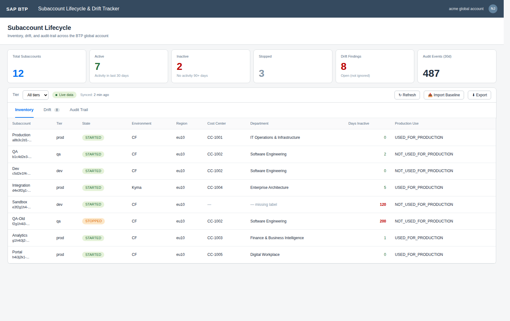

- Live inventory of every subaccount via CIS Accounts API
- Activity timestamps from Audit Log Retrieval — flags 90+ day inactive
- Drift detection: labels, service instances, role-collections vs tier baseline
- `activeUserCount` per subaccount via XSUAA enumeration (replaces the earlier deferred `0`)
- `importBaseline` / `exportBaseline` actions consume + emit the shared baseline-pack format ([`baselines/`](baselines/))
- Live/mock data-source badge + last-synced timestamp surfaced on the toolbar (cross-app standard)
- **Deployment: 1.5 hr per client**

---

#### `02` Destination & Connectivity Inventory

Every destination across every subaccount with risk scoring — basic auth, expiring certs, dangling targets.

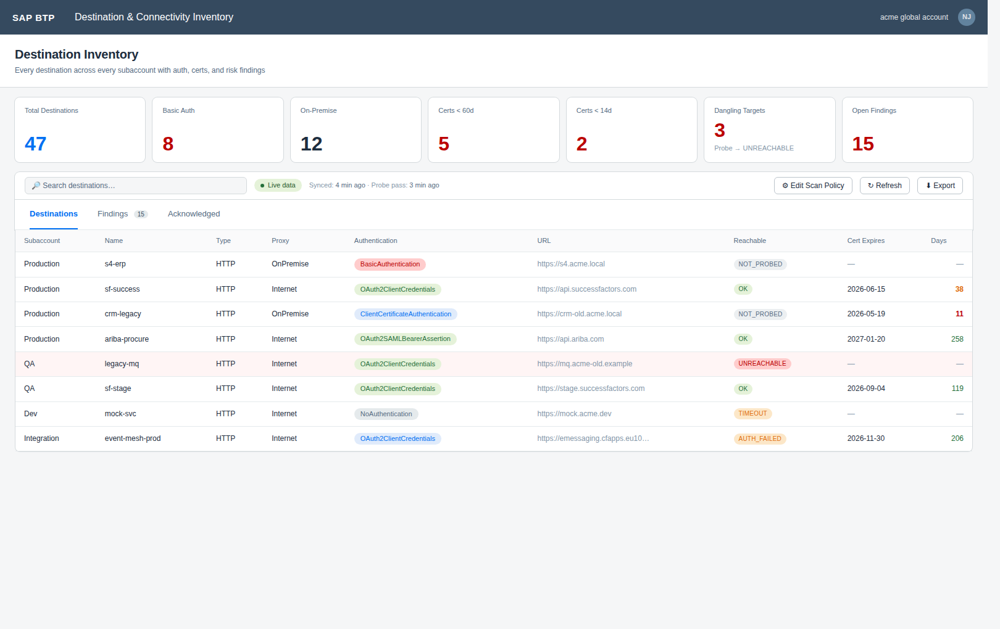

- Walks every subaccount's destination service via `SUBACCOUNT_KEYS`
- Parses x509 certificate content for expiry dates
- Live reachability probe per destination — taxonomy: `OK` / `AUTH_FAILED` / `UNREACHABLE` / `TIMEOUT` / `NOT_PROBED` (bounded 5-lane parallel, 60s cache; OnPremise/ClientCert skipped to avoid noise)
- Probe is redirect-safe: `maxRedirects=0` so the resolved auth header never forwards to a 3xx target
- Findings: `BASIC_AUTH_IN_PROD`, `CERT_EXPIRING` (<14d / <60d), `DANGLING_TARGET` (probe = UNREACHABLE), `MTLS_AVAILABLE_NOT_USED` (curated mTLS-capable host catalog)
- ANS notifications fire on critical findings (severity = `error`); 12h dedup prevents refresh-spam
- Acknowledgement workflow with snooze-until — preserves audit trail
- **Deployment: 1 hr per client**

---

#### `03` Architecture Compliance Scorecard ★ IP centerpiece

Your codified governance opinion, running on the customer's real data, exporting the engagement deck.

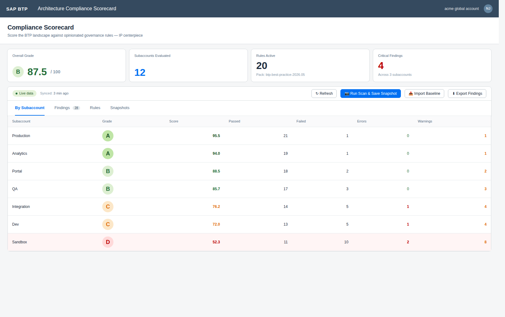

- Rule engine with **14 evaluators** and **20 canonical rules** out of the box (governance / identity / network / cost / hygiene), aligned to CIS BTP Benchmark themes — cited in each rule's description
- Per-subaccount A/B/C/D/F grading; overall global-account score
- `ScoreAdmin` can edit rules in the workshop — tuned ruleset stays with the customer
- Snapshot persistence enables "before vs after" deliverable at every QBR
- `importBaseline(packJson)` / `exportBaseline()` actions for sharing tuned rule sets across engagements via the [`baselines/`](baselines/) directory
- ANS notification on `D`/`F` grade regression (severity-mapped to FATAL/ERROR)
- **Deployment: 30 min per client** (composes data from #1 + #2)

---

### Tier 2 — high-value, narrower fit

#### `04` CIS/IAS Identity Federation Health Check

The silent failures in IAS↔XSUAA federation — surfaced before they become an audit finding.

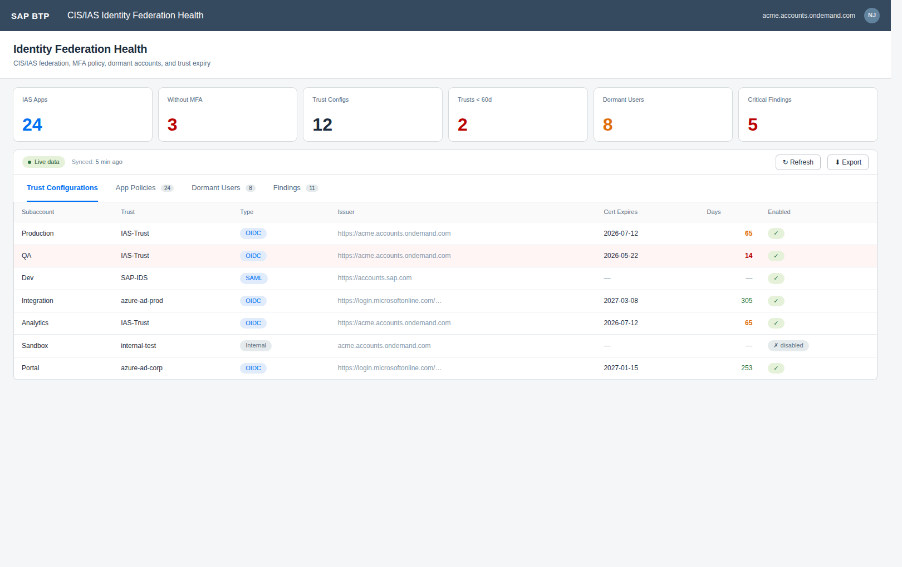

- Trust configurations enumerated per subaccount with cert expiry parsing
- IAS Application list with MFA-enforcement detection per app
- SCIM dormant-user detection (90+ days from custom lastLogin extension)
- Findings: `TRUST_CERT_EXPIRING`, `MFA_MISSING_ON_ADMIN_APP`, `DORMANT_USER`
- **Deployment: 2 hr per client**

---

#### `05` Role-Collection & Identity Map

*"Who can deploy to prod?"* Most customers cannot answer this — and now they have to.

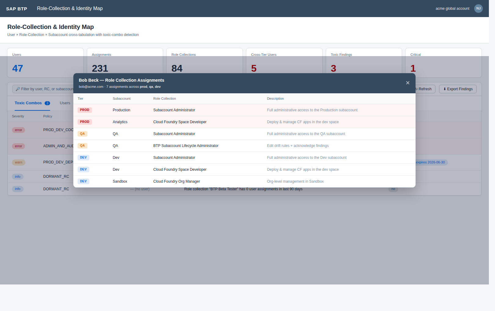

- Walks every subaccount's XSUAA Authorization API for RC enumeration + per-RC user lists
- Email-keyed cross-tabulation aggregates "the same human" across tenants
- 3 baseline toxic-combo policies: prod-dev admin, prod-dev deployer, admin-and-auditor
- Per-user assignment drill-down: opens a sortable dialog showing all 5 `RcAssignment` fields (tier / subaccount / RC / description) — tier-ordered prod-first
- Admin can author new policies in-app
- **Deployment: 1.5 hr per client**

---

#### `06` Audit-Log & Change Inventory Console

Unified change timeline across subaccounts. The deliverable a SOX/ISO walkthrough is built around.

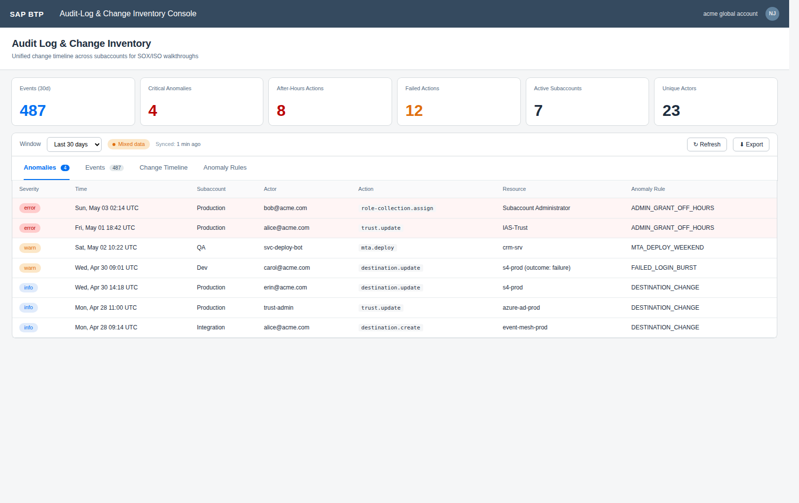

- Aggregates Audit Log Retrieval Service + cTMS deployment history
- Filter by actor, action, resource type. Exportable for SOX/ISO/internal audit
- Anomaly detection: 4 seeded rules (admin-grant off-hours, weekend MTA deploy, destination change, failed action)
- **Deployment: 1 hr per client**

---

#### `07` Entitlement & License Optimization Advisor

Hard ROI for the renewal conversation. Gives procurement a number; gives you the next engagement.

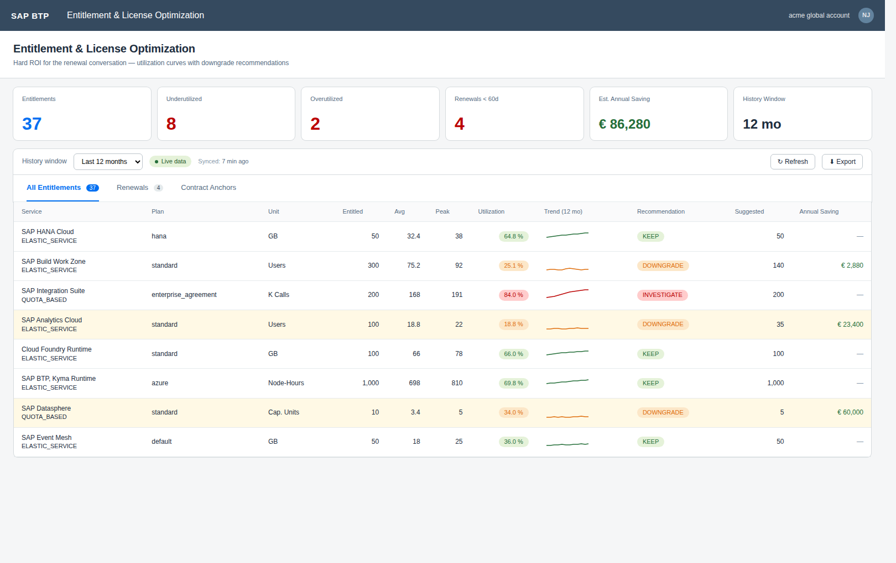

- CIS Entitlements + UAS 12-24 month utilization history
- "Approaching renewal" highlighting; downgrade recommendations with €/yr saving
- `KEEP`/`DOWNGRADE`/`INVESTIGATE` classification per service+plan
- Operator-seeded `ContractAnchor` table provides unit prices for €-saving calc
- Per-row **trend sparkline** rendered from the `history: UsagePoint[]` payload (LineMicroChart, colour-banded by utilization)
- **Deployment: 1 hr + 3 hr to seed `ContractAnchors` for the top-10 services**

---

### Tier 3 — differentiating wedge apps

#### `08` BTP AI Services Governance Console

*"What people are actually doing with GenAI"* — the question every CISO is being asked in board meetings.

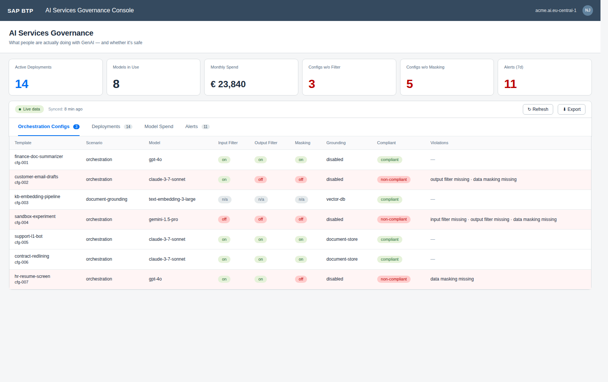

- Generative AI Hub orchestration prompts deployed where, by whom
- Per-model EUR spend ESTIMATED from real AI Core `/v2/lm/metrics` token counts × a maintained `MODEL_RATE_CARD` of SAP-published list prices (the spend KPI is no longer a fixed mock)
- Content-filter & data-masking config per scenario with compliance scoring
- Prompt-injection alerts; prohibited-data egress detection
- **Deployment: 1 hr per client**

---

#### `09` Trust Config & Cert Expiry Console

Every certificate across the BTP landscape with rotation owner, blast radius, and acknowledgement workflow.

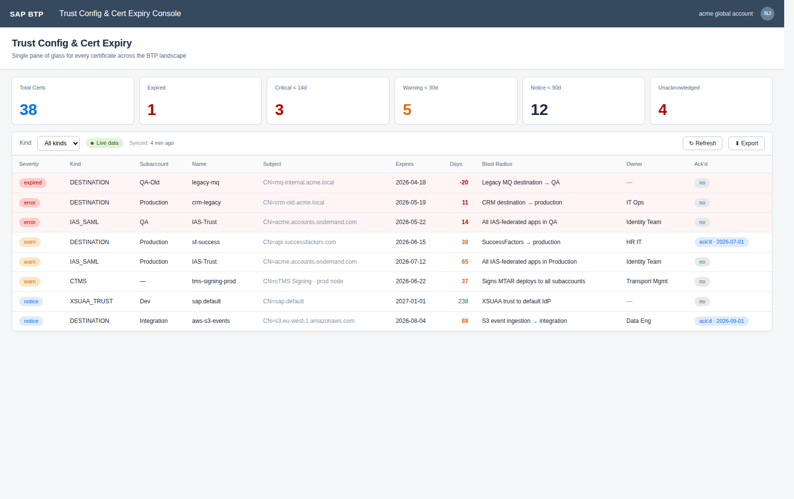

- Aggregates from **destinations** (live), **IAS SAML/OIDC trust configs** (live via `/Trust`), **XSUAA trust configs** (live via `/sap/rest/authorization/v2/trust-configurations`, accepts `XSUAA_KEYS` or `SUBACCOUNT_KEYS.xsuaa`), and **cTMS signing identities** (live via `/v2/landscapeIdentities`)
- Defensive cert-candidate extraction handles 6 known field locations + 3 envelope shapes so SAML, OIDC, and cTMS-specific responses all contribute
- Severity ladder: notice (90d) → warn (30d) → critical (14d) → expired
- Per-engagement rotation-owner registry maps cert patterns to named humans
- Acknowledge-until workflow suppresses noise during planned rotation windows
- ANS notification on `error` / `expired` severity certs (12h dedup); blast-radius and rotation-owner embedded in the alert body
- **Deployment: 30 min per client** (reuses #2 + #4 keys)

---

#### `10` Landscape Cost-Allocation & Showback Engine

Moves the CFO from *"show me costs"* to *"approved, here's the chargeback policy."*

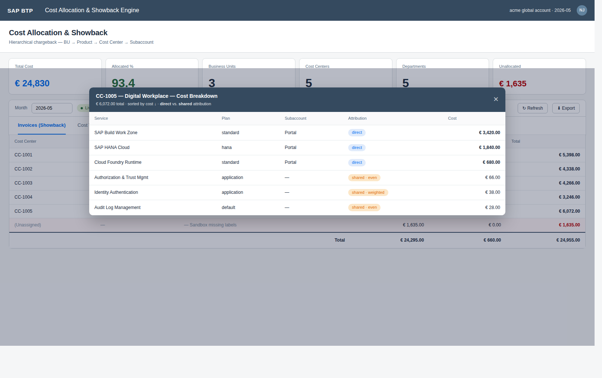

- Hierarchical cost tree: BU → Product → Cost Center → Subaccount
- Per-cost-center invoices generated from CIS labels
- Configurable shared-service allocation (XSUAA, audit log, IAS) with split rules: `direct`, `even`, `weighted`
- Invoice → `LeafCost` drill-down dialog: click any invoice row to see service-level attribution (service, plan, subaccount, cost), sorted by cost descending
- Goes beyond per-subaccount cost views — full chargeback semantics
- **Deployment: 1 hr + 3 hr to import org hierarchy**

---

### Tier 4 — separate stack

#### `11` Clean Core Compliance Dashboard

The single most-asked question in any clean-core engagement — answered with code, not opinion.

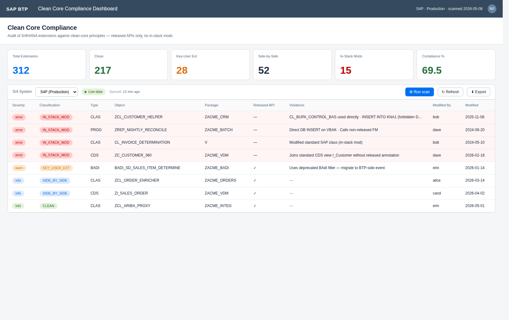

- Per-extension audit: unreleased SAP API usage, classic in-stack mods, ABAP Cloud violations
- Classification: `CLEAN` | `SIDE_BY_SIDE` | `KEY_USER_EXT` | `IN_STACK_MOD`
- **Separate architecture**: requires Cloud Connector + ABAP scanner package transported into S/4
- CAP/UI5 frontend reused; data acquisition is bespoke per S/4 estate
- **Deployment: ~1 day per client** (ABAP transport + Cloud Connector + virtual host)

---

## Engagement-level deployment timing

| Scope | Total deploy | Sells as |
|---|---|---|
| Day-1 demo (#1 only) | **90 min** | Discovery workshop |
| Tier 1 pilot (#1, #2, #3) | **3 hr** | Scoped pilot — IP-centerpiece scorecard live for the first workshop |
| First-wave engagement (#1–#5, #9) | **~1 day** | 4-week engagement, before/after deliverable |
| Full BTP-native (#1–#10) | **2 days + 6 hr seed** | Full arsenal except Clean Core |
| Full arsenal incl. #11 | **3–4 days** | Add 1 day for ABAP scanner + Cloud Connector |

---

## Technical architecture

Every app follows the same shape:

```
┌─────────────────────────────────────────────────────────────┐
│  SAPUI5 1.120 freestyle                                     │
│  KPI tiles · table · Excel/PPTX export                      │
├─────────────────────────────────────────────────────────────┤
│  CAP @sap/cds ^9 (Node.js)                                  │
│  OData v4 service · XSUAA roles · CDS persistence           │
├─────────────────────────────────────────────────────────────┤
│  srv/lib/ (shared, duplicated across apps)                  │
│  oauth-cache · cis-client · subaccount-clients              │
│  + notification (ANS, all 11) + uas-client (#7/#10)         │
│  + aicore-client (#8)                                       │
├─────────────────────────────────────────────────────────────┤
│  Customer BTP APIs                                          │
│  CIS · UAS · Audit Log · Destination · XSUAA Authz · IAS    │
└─────────────────────────────────────────────────────────────┘
```

- **Leave-behind, not consultant-hosted.** Apps deploy to the *client's* subaccount. They keep it after the engagement.
- **Mock mode out of the box.** Every app boots with rich demo data when env vars aren't set.
- **Data-source provenance on every dashboard.** A coloured badge + "Synced: <time>" label distinguishes `live` / `mixed` / `mock` runs at a glance — admin trust survives the moment they realise some panels are demo data.
- **Per-clientid OAuth token cache.** Same proven pattern across all apps.
- **XSUAA scope split: `{App}Viewer` / `{App}Admin`.** Read access for workshop attendees; tuning rights for the lead architect.

### Cross-cutting: Alert Notification Service (ANS)

Shared `srv/lib/notification.js` — duplicated across every app per the existing `srv/lib/` convention. It's an ANS producer:

```text
POST {ANS_URL}/cf/producer/v1/resource-events
```

OAuth2 client-credentials via `ANS_OAUTH_URL` + `ANS_CLIENT_ID` + `ANS_CLIENT_SECRET`. Routing to Slack / Teams / email / webhook is configured on the ANS side (subscription rules matching `eventType` / `severity` / `tags`), so the producer only emits events.

In-process dedup keyed by `(eventType, severity, resource)` with a 12-hour TTL prevents alert-spam on dashboard refresh. **No-op when env vars are unset** — every app is safe to call unconditionally; demo mode stays clean.

Apps with live producers wired up today: **#02** (critical destination findings), **#03** (`D`/`F` overall grade regression), **#09** (`error`/`expired` cert severity). Other apps carry the lib for the next sprint.

### Cross-cutting: Baseline packs

[`baselines/btp-best-practice-2026.05.json`](baselines/) — single JSON file bundling the canonical drift-baselines for app #1 + the 20 canonical compliance rules for app #3, all in one place. Maps to CIS BTP Benchmark themes, cited inline in each rule's description.

```jsonc
{
  "version": "2026.05",
  "01-subaccount-lifecycle": { "driftBaselines": [ ... ] },
  "03-compliance-scorecard": { "rules":          [ ... ] }
}
```

Two new endpoints per affected app:

- `action importBaseline(packJson: LargeString)` — upserts the relevant section. `{App}Admin` scope.
- `function exportBaseline() returns LargeString` — dumps current state in the same pack shape so engagement-specific tweaks can be checked back in and shipped to the next customer.

See [`baselines/README.md`](baselines/README.md) for the apply-at-deploy workflow (jq + curl).

### `SUBACCOUNT_KEYS` env var (cross-app standard)

Apps #1, #3, #4, #5, #6, and #9 share a `SUBACCOUNT_KEYS` env var that bundles per-subaccount service-keys for Destination, XSUAA Authorization (`apiaccess` plan), Service Manager, and Audit Log:

```json
[
  {
    "subaccountId":   "<guid>",
    "subaccountName": "Production",
    "tier":           "prod",
    "destination":    { "uaa": {...}, "uri":    "https://destination-..." },
    "xsuaa":          { "uaa": {...}, "apiurl": "https://api.authentication-..." },
    "serviceManager": { "uaa": {...}, "sm_url": "https://service-manager-..." },
    "auditLog":       { "uaa": {...}, "url":    "https://auditlog-..." }
  }
]
```

Any sub-section may be omitted — corresponding capability returns empty.

---

## Getting started

### Local dev (any app)

```powershell
cd 01-subaccount-lifecycle
npm install
npm install --prefix app/lifecycle-dashboard
npm run watch
# OData at http://localhost:4004/odata/v4/lifecycle/
```

Mock data is returned when the relevant `*_CREDENTIALS` / `*_KEYS` env vars are unset — every app boots and demos end-to-end out of the box.

### Build & deploy

```powershell
mbt build -p cf
cf deploy mta_archives/<id>_1.0.0.mtar -e mta-ext-<client>.mtaext
```

See [`RUNBOOK-client-deploy.md`](RUNBOOK-client-deploy.md) for the full 11-step per-client delivery checklist.

---

## Differentiation

|  |  |
|---|---|
| **11 apps** all shipping today | Operational tooling, not narrative deliverables |
| **1 MTA shape** across the 10 BTP-native apps | A skeleton, not a reinvented wheel |
| **< 2 hr** per-app per-client deploy | A delivery team that scales — not bound to one architect |

---

## Repository layout

```
01-subaccount-lifecycle/   ┐
02-destination-inventory/  │
03-compliance-scorecard/   │  Each app: CAP backend + UI5 frontend
04-identity-federation/    │   ├── mta.yaml + package.json + xs-security.json
05-role-collection-map/    │   ├── db/schema.cds
06-audit-log/              │   ├── srv/<app>-service.{cds,js}
07-entitlement-optimization│   ├── srv/lib/{oauth-cache,cis-client,subaccount-clients}.js
08-ai-governance/          │   ├── app/<ui>/webapp/...
09-cert-expiry/            │   └── README.md
10-cost-allocation/        │
11-clean-core/             ┘

_pitch-deck/               Pitch deck — pptxgenjs source + screenshots
RUNBOOK-client-deploy.md   Per-client delivery checklist (11 steps)
```

---

## Pitch deck

A 20-slide PowerPoint pitch deck is included at [`_pitch-deck/BTP-Advisory-Pitch.pptx`](_pitch-deck/BTP-Advisory-Pitch.pptx). Source for the deck is [`_pitch-deck/build-deck.js`](_pitch-deck/build-deck.js) — regenerate with `node build-deck.js`.

App screenshots used in this README and in the deck are rendered from HTML mockups in [`_pitch-deck/mockups/`](_pitch-deck/mockups/) via headless Chromium. Regenerate with `node render-screenshots.js` (auto-detects chromium at `/opt/pw-browsers/`, `/usr/bin/chromium`, or `$CHROMIUM`).

---

## Testing

Every app has a test suite gated by GitHub Actions CI ([`.github/workflows/test.yml`](.github/workflows/test.yml)). The pilot app `03-compliance-scorecard` carries the canonical [`test/README.md`](03-compliance-scorecard/test/README.md) with the layout, conventions, and rollout playbook.

| App | Tests | Coverage focus |
|---|---:|---|
| `01-subaccount-lifecycle`     |  49 | pure helpers, oauth-cache, cis-client, `uniqueUserCount` (sinon), notification lib, baseline import/export integration |
| `02-destination-inventory`    |  51 | `daysUntil`, `parseCertNotAfter`, probe gate / headers / classifier, full reachability probe + bounded `probeAll` via nock, redirect-leak guard, `isMtlsCapableUrl`, dangling-target + mTLS findings, notification lib |
| `03-compliance-scorecard`     |  68 | all 14 rule evaluators (pass + fail cases), `buildScorecard`, `gradeFor`, `runScan` persistence, baseline import/export round-trip, notification lib |
| `04-identity-federation`      |  37 | `pemNotAfter`, `daysUntil`, `hasIasCredentials`, cis-client, integration, notification lib |
| `05-role-collection-map`      |  39 | `inferTier`, `loadAssignments` (sinon-stubbed), toxic-finding integration, notification lib |
| `06-audit-log`                |  29 | `inWindow` time-band logic, anomaly rules, integration, notification lib |
| `07-entitlement-optimization` |  47 | UAS client, `ymOffset`, multi-month fetch race, integration, notification lib |
| `08-ai-governance`            |  45 | `inferProvider`, AI Core client, `fetchMetrics` + `extractTokens` + `aggregateMetricsToSpend` + rate-card cost math, notification lib |
| `09-cert-expiry`              |  56 | `severityFor`, `lookupOwner`, cert-candidate extraction across 9 field shapes, IAS `/Trust`, XSUAA trust-configurations, cTMS `/v2/landscapeIdentities` scans (all via nock), notification lib |
| `10-cost-allocation`          |  49 | UAS client, cost split, `currentYM`, integration, notification lib |
| `11-clean-core`               |  19 | `classify` heuristics, scan-run persistence, notification lib |
| **Total**                     | **489** | |

### Toolchain (uniform across all 11 apps)

- **Mocha** (test runner) + **Chai** (assertions) + **Sinon** (spies/stubs) + **Nock** (HTTP interception) + **c8** (V8-native coverage)
- **`@sap/cds/lib`'s `cds.test`** for OData integration tests against the `[development]` profile (`auth: dummy`, in-memory SQLite)
- **`module.exports.__test__ = { ... }`** seam on each service file exposes pure helpers for direct unit testing without booting CAP

### Common commands (in any app dir)

```bash
npm test                  # everything: unit + integration
npm run test:unit         # pure-function tests only (< 2s)
npm run test:integration  # cds.test against the in-memory service
npm run test:coverage     # writes lcov + text summary
```

### Layout (identical in every app)

```
<app>/
├── .mocharc.json       (copied verbatim across apps)
├── .c8rc.json          (copied verbatim across apps)
└── test/
    ├── helpers/
    │   ├── fixtures.js     (per-app data fixtures)
    │   └── nock-helpers.js (largely portable; per-app endpoint helpers added)
    ├── unit/               (pure helpers + lib unit tests with nock)
    └── integration/        (cds.test OData round-trips in mock-mode)
```

For details and how to add a new app to the suite, see [`03-compliance-scorecard/test/README.md`](03-compliance-scorecard/test/README.md).
